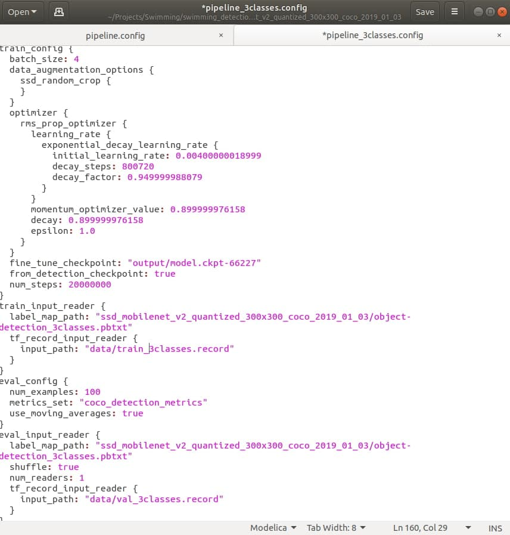

# Coral mobilenet_ssd_v2 detector training 
<p> The following instructions work for both CPU and GPU training. If you want to train the model on GPU, additionally install the tensorflow-gpu==1.15, cuda-10 and cudnn7. Here are the instructions for doing it on Ubuntu 18.04 https://gist.github.com/pavloshargan/52ac358ce089aa62f3c87af829760ceb</p>
<p>
<br/>

First of all, download the ssd_mobilenet_v2_quantized_300x300_coco_2019_01_03 model with weights from here https://drive.google.com/file/d/16KlNcpqo-oscIb-ihFJORByxCxQu5FwA/view?usp=sharing


## Then set up the environment

<br/>

```bash
git clone git@github.com:tensorflow/models.git
git checkout 400d68a
```
<br>

```bash
python3 -m pip install --upgrade pip

pip3 install tensorflow==1.15.0 lxml pillow matplotlib jupyter contextlib2 cython tf_slim pandas scipy opencv-python
```

```bash
#From the models/research
protoc object_detection/protos/*.proto --python_out=.

python3 setup.py build

python3 setup.py install
```

```bash
pip3 install pycocotools
```

Copy all files from models/research/object_detection/legacy to models/research/object_detection<br>

Copy all files from models/research/slim to models/research/object_detection<br>

Replace models/research/object_detection/imagenet.py with imagenet.py in current repo <br>

Replace object_detection/export_inference_grapgh.py with export_inference_graph.py in the current repo<br>
</p>

# Dataset

The images were annotated via labelImg tool, that can be installed via:

 ```bash
git clone https://github.com/tzutalin/labelImg.git
```
then
 ```bash
 #from labelImg directory
 python3 setup.py 
 #run the program
 python3 labelimg.py
 ```
 Run the program and open the directory with images <br>
How to annotate an image:<br>
Click 'create RectBox' and select the object, say car, label it with 'car' word. If it is bicycle, label as 'bicycle' etc.<br>
After you click 'save', .xml file for the image will be created in the same folder.<br>
Click 'Next' and do this procedure for all images
<br>
<br>

## The next step is preparing data and pre-trained weights for training 

Convert annotations to csv: <br>
Change the pathes inside the script (specify path to YourDataset directory)
```bash
python3 xml_to_csv.py
```

Then generate 2 .tfrecord files (for training and validation data).
```bash
python3 generate_tfrecord.py --csv_input=data/train_labels.csv  --output_path=data/train.record 
```

```bash
python3 generate_tfrecord.py --csv_input=data/val_labels.csv  --output_path=data/val.record 
```

Now, when the data is ready for training
move train.record and val.record into ~models/research/object_detection/data <br>

move
ssd_mobilenet_v2_quantized_300x300_coco_2019_01_03 (the model with weights you downloaded) to ~models/research/object_detection<br>


Run the model training. Checkpoints are stored in the specified model_dir  folder
<br>
Check if the NUMBER_CLASSES variable and the pathes in the pipeline are correct.
Change the batch size if needed. Note, that with batch size 4, 16gb of RAM and up to 30gb of addtionaly allocated swap were used, while training on GTX1060 6gb GPU.




Now, when the data is ready for training
move train.record and val.record into ~models/research/object_detection/data <br>


## Run the training

```bash
#from models/research/object_detection
python3 model_main.py --pipeline_config_path=ssd_mobilenet_v2_quantized_300x300_coco_2019_01_03/pipeline_3classes.config --model_dir=output --alsologtostderr

tensorboard --logdir=output
```

Export the .pb graph:
 (change the name of model.ckpt-12345 file according to checkpoint filename)

 ```bash
 #from models/research/object_detection
python3 export_inference_graph.py --input_type image_tensor --pipeline_config_path ssd_mobilenet_v2_quantized_300x300_coco_2019_01_03/pipeline_3classes.config --trained_checkpoint_prefix output/model.ckpt-12345 --output_directory new_pb_graph
```


Export the tflite graph:
 (change the name of model.ckpt-12345 file according to checkpoint filename)

 ```bash
 #from models/research/object_detection
python3 export_tflite_ssd_graph.py  --pipeline_config_path=ssd_mobilenet_v2_quantized_300x300_coco_2019_01_03/pipeline_3classes.config  --trained_checkpoint_prefix=output_classes/model.ckpt-12345  --output_directory=quantinized_tflite_model_3classes  --add_postprocessing_op=true
```
 ```bash
tflite_convert  --output_file=quantinized_tflite_model_3classes/tflite_graph_optimized.tflite --graph_def_file=quantinized_tflite_model_3classes/tflite_graph.pb  --inference_type=QUANTIZED_UINT8 --input_arrays=normalized_input_image_tensor  --output_arrays="TFLite_Detection_PostProcess,TFLite_Detection_PostProcess:1,TFLite_Detection_PostProcess:2,TFLite_Detection_PostProcess:3" --mean_values=128 --std_dev_values=128 --input_shapes=1,300,300,3 --change_concat_input_ranges=false --allow_custom_ops
```
<br>

Then compile the tflite model for Coral TPU: <br> <br>
Install EdgetpuCompiler folowing these instructions https://coral.ai/docs/edgetpu/compiler/
```bash
edgetpu_compiler quantinized_tflite_model_3classes/tflite_graph_optimized.tflite
```

The result is tflite_graph_optimized_edgetpu.tflite compiled model, that can be run on Coral USB Accelerator with ~9ms of latency (110FPS).
